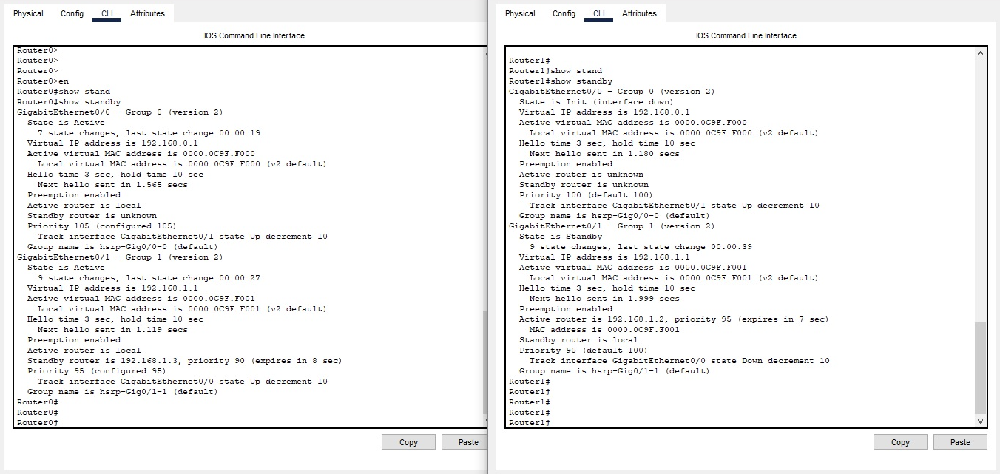
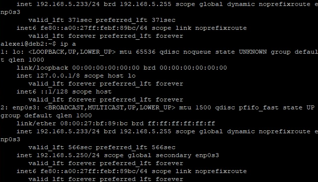
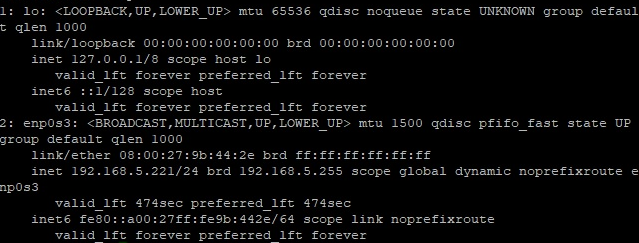
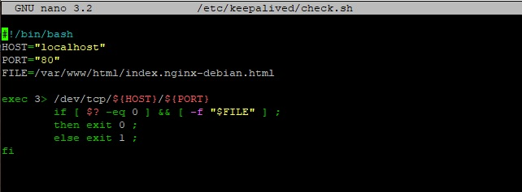
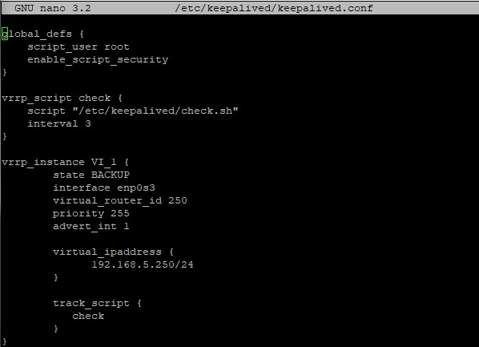

# Домашнее задание к занятию «Disaster recovery и Keepalived»" - `Мильдзихов Сергей`


### Цель задания

В результате выполнения этого задания вы научитесь:

1. Настраивать отслеживание интерфейса для протокола HSRP;
2. Настраивать сервис Keepalived для использования плавающего IP


### Чеклист готовности к домашнему заданию

1. Установлена программа Cisco Packet Tracer
2. Установлена операционная система Ubuntu на виртуальную машину и имеется доступ к терминалу
3. Сделан клон этой виртуальной машины, они находятся в одной подсети и имеют разные IP адреса
4. Просмотрены конфигурационные файлы, рассматриваемые на лекции, которые находятся по ссылке

---

### Задание 1

1. Дана схема для Cisco Packet Tracer, рассматриваемая в лекции.
2. На данной схеме уже настроено отслеживание интерфейсов маршрутизаторов Gi0/1 (для нулевой группы)
3. Необходимо аналогично настроить отслеживание состояния интерфейсов Gi0/0 (для первой группы).
4. Для проверки корректности настройки, разорвите один из кабелей между одним из маршрутизаторов и Switch0 и запустите ping между PC0 и Server0.
5. На проверку отправьте получившуюся схему в формате pkt и скриншот, где виден процесс настройки маршрутизатора.

### Ответ


### Проводим настройку Router0 с помощью данных команд:
Заходим в интерфейс gigabitEthernet0/1:

``` interface gigabitEthernet 0/1 ```

Включим режим preempt

``` standby 1 preempt ```

Изменим приоритет маршрутизатора

``` standby 1 priority 95 ```

Через CLI в Cisco Packet Tracer выведем информацию на Router0 с помощью команды sh standby

``` GigabitEthernet0/0 - Group 0 (version 2)
  State is Active
    7 state changes, last state change 00:00:19
  Virtual IP address is 192.168.0.1
  Active virtual MAC address is 0000.0C9F.F000
    Local virtual MAC address is 0000.0C9F.F000 (v2 default)
  Hello time 3 sec, hold time 10 sec
    Next hello sent in 1.339 secs
  Preemption enabled
  Active router is local
  Standby router is 192.168.0.3
  Priority 105 (configured 105)
    Track interface GigabitEthernet0/1 state Up decrement 10
  Group name is hsrp-Gig0/0-0 (default)
GigabitEthernet0/1 - Group 1 (version 2)
  State is Standby
    9 state changes, last state change 00:00:38
  Virtual IP address is 192.168.1.1
  Active virtual MAC address is 0000.0C9F.F001
    Local virtual MAC address is 0000.0C9F.F001 (v2 default)
  Hello time 3 sec, hold time 10 sec
    Next hello sent in 1.11 secs
  Preemption enabled
  Active router is 192.168.1.3
  Standby router is local
  Priority 95 (configured 95)
    Track interface GigabitEthernet0/0 state Up decrement 10
  Group name is hsrp-Gig0/1-1 (default)
```

### На Router1 нужно производим настройку. Для этого перейдем в настройки интерфейса. gigabitEthernet 0/1.

``` interface gigabitEthernet 0/1 ```

Настроим отслеживание интерфейса gigabitEthernet 0/0

``` standby 1 track gigabitEthernet 0/0 ```

Через CLI в Cisco Packet Tracer выведем информацию на Router0 с помощью команды sh standby

``` Router1#sh standby 
GigabitEthernet0/0 - Group 0 (version 2)
  State is Standby
    9 state changes, last state change 00:00:39
  Virtual IP address is 192.168.0.1
  Active virtual MAC address is 0000.0C9F.F000
    Local virtual MAC address is 0000.0C9F.F000 (v2 default)
  Hello time 3 sec, hold time 10 sec
    Next hello sent in 1.671 secs
  Preemption enabled
  Active router is 192.168.0.2
  Standby router is local
  Priority 100 (default 100)
    Track interface GigabitEthernet0/1 state Up decrement 10
  Group name is hsrp-Gig0/0-0 (default)
GigabitEthernet0/1 - Group 1 (version 2)
  State is Active
    7 state changes, last state change 00:00:27
  Virtual IP address is 192.168.1.1
  Active virtual MAC address is 0000.0C9F.F001
    Local virtual MAC address is 0000.0C9F.F001 (v2 default)
  Hello time 3 sec, hold time 10 sec
    Next hello sent in 1.263 secs
  Preemption enabled
  Active router is local
  Standby router is 192.168.1.2
  Priority 100 (default 100)
  Group name is hsrp-Gig0/1-1 (default)
```

### По условию задания необходимо сделать проверить корректность настройки, разорвать один из кабелей между одним из маршрутизаторов и Switch0 и запустить ping между PC0 и Server0:
1. Для начала отключаем кабель от Router0:

``` %LINEPROTO-5-UPDOWN: Line protocol on Interface GigabitEthernet0/0, changed state to down ```

2. Состояние Router1 сразу меняется на Active

``` %HSRP-6-STATECHANGE: GigabitEthernet0/0 Grp 0 state Standby -> Active ```

3. Ping проходит успешно

4. Подключаем кабель назад к Router0 и отключаем кабель от Router1

5. Ping проходит успешно

`

[Файл PKT mildzikhov.pkt](https://github.com/mildzikhov01/Disaster-recovery-Keepalived/blob/c9946cdccedc9ee0f2a957e550adb29085033472/mildzikhov.pkt)

---

### Задание 2

1. Запустите две виртуальные машины Linux, установите и настройте сервис Keepalived как в лекции, используя пример конфигурационного файла.
2. Настройте любой веб-сервер (например, nginx или simple python server) на двух виртуальных машинах
3. Напишите Bash-скрипт, который будет проверять доступность порта данного веб-сервера и существование файла index.html в root-директории данного веб-сервера.
4. Настройте Keepalived так, чтобы он запускал данный скрипт каждые 3 секунды и переносил виртуальный IP на другой сервер, если bash-скрипт завершался с кодом, отличным от нуля (то есть порт веб-сервера был недоступен или отсутствовал index.html). Используйте для этого секцию vrrp_script
5. На проверку отправьте получившейся bash-скрипт и конфигурационный файл keepalived, а также скриншот с демонстрацией переезда плавающего ip на другой сервер в случае недоступности порта или файла index.html


### Ответ

Мной были запущены две виртуальные машины на Linux Debian, далее по лекции настроен Keepalived по примеру конфигурационного файла. Запустил веб-сервер на nginx и написал свой Bash-скрипт который будет проверять доступность порта данного веб-сервера и существование файла index.html в root-директории данного веб-сервера:


``` exec 3> /dev/tcp/${HOST}/${PORT}
               if [ $? -eq 0 ] && [ -f "$FILE"]  ;
               then exit0 ;
               else exit 1 ;
```

В файле conf.txt прописана конфигурация по условию (каждые 3 секунды переносить IP на другой сервер).

Ниже представлены скриншоты работы виртуальных машин и Bash-скриптов (а также файлы самих скриптов):

`

`

`

`

`

`

[script.txt]([[https://github.com/mildzikhov01/Disaster-recovery-Keepalived/blob/c9946cdccedc9ee0f2a957e550adb29085033472/script.txt](https://github.com/mildzikhov01/Disaster-recovery-Keepalived/blob/main/script.txt)](https://github.com/mildzikhov01/Disaster-recovery-Keepalived/blob/main/script.txt))

[conf.txt](https://github.com/mildzikhov01/Disaster-recovery-Keepalived/blob/main/conf.txt)

---


